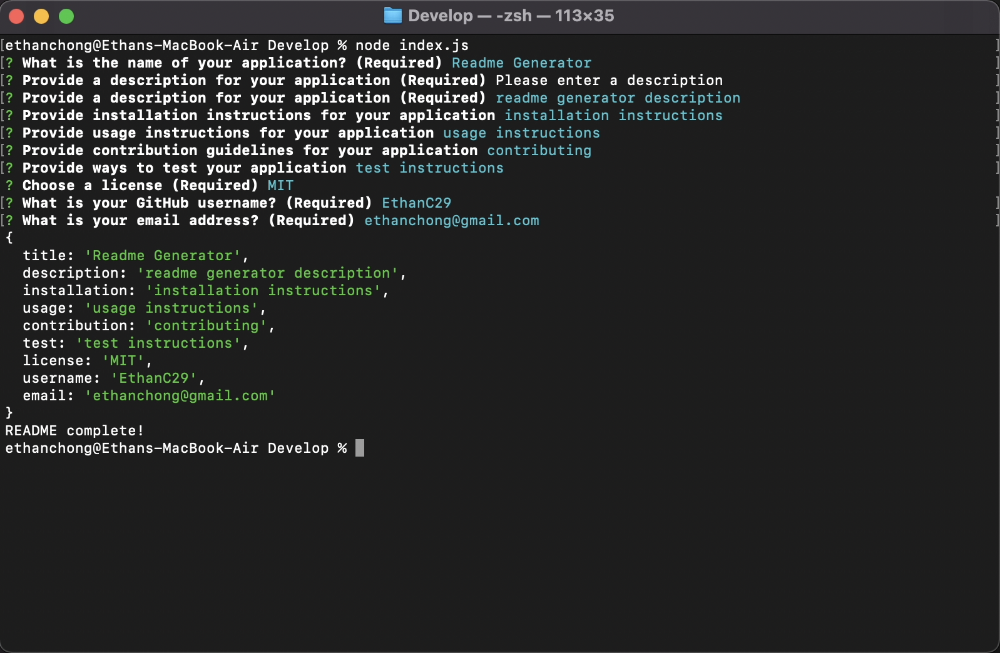

  # README Generator
  
  
  
  
  
  <br />
  

  ## Description
  A README.md file generator to create a new file to include all the details of your application.<br /><br />
  
  [Here](./src/usage.mov) is a video showing the full functionality of the application.<br />
  A sample README file resulting from the functionality video is also available [here](./dist/sample-readme.md) with a video of its working links [here](./src/readme-sample.mov).
  ### User Story
  ```
  AS A developer
  I WANT a README generator
  SO THAT I can quickly create a professional README for a new project
  ```
  ### Acceptance Criteria
  ```
  GIVEN a command-line application that accepts user input
  WHEN I am prompted for information about my application repository
  THEN a high-quality, professional README.md is generated with the title of my project and sections entitled Description, Table of Contents, Installation, Usage, License, Contributing, Tests, and Questions
  WHEN I enter my project title
  THEN this is displayed as the title of the README
  WHEN I enter a description, installation instructions, usage information, contribution guidelines, and test instructions
  THEN this information is added to the sections of the README entitled Description, Installation, Usage, Contributing, and Tests
  WHEN I choose a license for my application from a list of options
  THEN a badge for that license is added near the top of the README and a notice is added to the section of the README entitled License that explains which license the application is covered under
  WHEN I enter my GitHub username
  THEN this is added to the section of the README entitled Questions, with a link to my GitHub profile
  WHEN I enter my email address
  THEN this is added to the section of the README entitled Questions, with instructions on how to reach me with additional questions
  WHEN I click on the links in the Table of Contents
  THEN I am taken to the corresponding section of the README  
  ```

  ## Table of Contents
  * [Description](#description)
  * [Installation](#installation)
  * [Usage](#usage)
  * [License](#license)
  * [Questions](#questions)

  ## Installation
  1. Clone the repository and navigate to the root directory of the repo (the one with index.js in it)
  2. `npm init`
  3. `npm install inquirer`

  ## Usage
  `node index.js`
  
  ## License
  <br />
  This application is covered by the Apache license.
  
  ## Questions
  Created by: [EthanC29](https://github.com/EthanC29)<br />
  For any additional questions, I can be reached at [ethanchong@gmail.com](mailto:ethanchong@gmail.com)
  